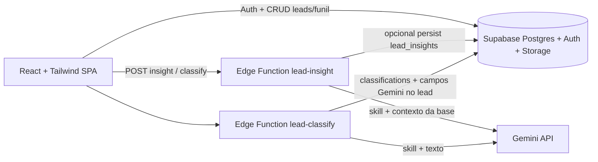

# 02 — Arquitetura Spec-Driven Development

## Princípio

```
Enunciado → Specs (docs/) → Código → Aceite (critérios)
```

Nenhuma feature “grande” sem spec correspondente em `docs/specs/`.

---

## Visão do sistema



---

## Stack

| Camada | Tecnologia |
|--------|------------|
| Front | React + TypeScript + Tailwind + Vite |
| Auth / DB / Storage | Supabase |
| IA | Gemini (`GEMINI_API_KEY` secret no Supabase) |
| Host | Vercel ou Netlify (gratuito) |
| Agentes IA | **Supabase Edge Functions** (Deno) |

---

## Agentes = Edge Functions (não Cursor Skills)

| Agente | Função Supabase | Responsabilidade |
|--------|-----------------|------------------|
| Insight Lead | `lead-insight` | Resumo + próximo passo só com dados da base |
| Classificador | `lead-classify` | Intent / score / labels |

Cada função embute sua **skill** (`skill.ts`) + doc (`AGENT.md`) **na mesma pasta** — ver [`supabase/functions/README.md`](../supabase/functions/README.md).

### Proibido neste projeto

- Skills em `.cursor/skills/`
- Pasta `docs/agents/` (movida para as functions)
- Skills em pasta `skills/` na raiz como runtime de IA  
- Expor `GEMINI_API_KEY` com prefixo `VITE_`

### Permitido no Cursor

- Rules apontando para `docs/` (orientação SDD)
- Gateway local **somente** em dev se Edge Function ainda não deployada — estado alvo: front chama Edge Functions

---

## Camadas do front

```
src/
  pages/          # rotas
  components/     # UI (SideOver, cards, ficha)
  layouts/        # AppShell fixo
  lib/            # supabase client, leads, pipelines, ai (chamada às Edge Functions)
  contexts/       # Auth
```

## Camadas Supabase

```
supabase/
  schema.sql / upgrade-robusto.sql
  functions/
    README.md             # índice dos agentes
    _shared/              # cors, gemini
    lead-insight/         # index.ts + skill.ts + AGENT.md
    lead-classify/        # index.ts + skill.ts + AGENT.md
```

---

## Dados (resumo)

Ver [specs/05-dados-modelagem.md](./specs/05-dados-modelagem.md).

Núcleo: `leads` ← `tentativas_compra`, `respostas_pesquisa`, `classifications`, `lead_insights`  
Auxiliares: `pipelines`, `pipeline_stages`, `profiles`

---

## UX obrigatória (produto)

- Sidebar + header **fixos**
- Kanban: **scroll vertical por coluna**
- Ficha e formulários em **sideover** (não modal central)
- Avatares nos cards
- Favicon 16x16 em `/favicons/` (sem distorcer)

---

## Fluxo de implementação (SDD)

1. Abrir spec da feature  
2. Implementar  
3. Marcar checklist do spec  
4. Conferir [01-criterios-avaliacao.md](./01-criterios-avaliacao.md)  
5. Só então considerar “pronto”
